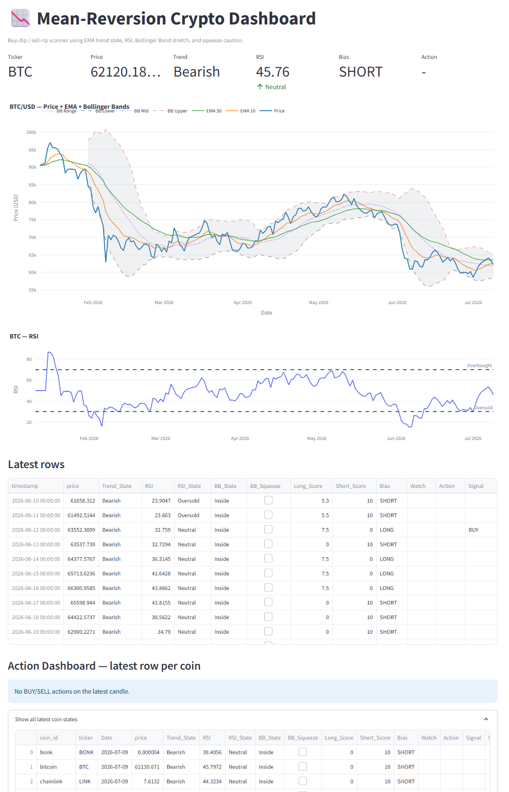

# Mean-Reversion Crypto Dashboard

A Streamlit-based cryptocurrency analytics dashboard designed to identify potential mean-reversion opportunities across Bitcoin and selected altcoins using technical signal confluence.

The project combines trend analysis, momentum indicators, Bollinger Band stretch detection, and multi-factor scoring logic to generate BUY, SELL, and WATCH conditions across multiple crypto assets.

The dashboard is designed for quantitative crypto analysis, signal monitoring, and educational experimentation rather than automated execution.

<p align="center">
  
</p>

---

# Features

## Interactive Dashboard
- Streamlit-powered web application
- Interactive Plotly visualizations
- Adjustable historical data window
- RSI chart toggle
- Multi-coin signal scanner
- Action dashboard for BUY/SELL setups

<p align="center">
  
</p>
---

## Technical Indicators
The dashboard integrates multiple technical indicators:

- Exponential Moving Averages (EMA)
- Relative Strength Index (RSI)
- Bollinger Bands
- Bollinger Band squeeze detection

---

## Signal Engine
The model evaluates multiple conditions simultaneously to generate:

- BUY signals
- SELL signals
- WATCH states
- Long/short scoring
- Trend classifications
- Trend-following and mean-reversion context

---

## Multi-Coin Scanner
The application scans multiple cryptocurrencies simultaneously and ranks actionable setups by signal strength.

The dashboard allows users to compare:
- trend state
- RSI conditions
- volatility structure
- long/short scoring
- latest actionable signals

across multiple digital assets in a single interface.

---

# Technologies Used

- Python
- Streamlit
- Pandas
- NumPy
- Plotly
- CoinGecko API

---

# Project Structure

```text
multi-coin-mean-reversion/
├── app.py
├── README.md
├── requirements.txt
├── .gitignore
├── notebooks/
├── src/
│   └── crypto_mr/
│       ├── config.py
│       ├── pipeline.py
│       ├── plotting.py
│       ├── indicators.py
│       └── strategy.py
└── data/
```

---

# Installation

## Clone the repository

```bash
git clone https://github.com/afgran-data/multi-coin-mean-reversion.git
```

---

## Install dependencies

```bash
pip install -r requirements.txt
```

---

## Run the dashboard

```bash
streamlit run app.py
```

---

# Example Workflow

1. Select a cryptocurrency from the sidebar.
2. Choose the historical data window.
3. Review:
   - trend state
   - RSI condition
   - Bollinger Band stretch
   - volatility squeeze state
4. Analyze generated BUY/SELL/WATCH conditions.
5. Compare opportunities across multiple coins using the action dashboard.

---

# Signal Logic

The strategy uses a multi-factor scoring approach instead of relying on a single indicator.

Example factors include:

- Oversold RSI during bullish trends
- Bollinger Band downside extension
- Mean-reversion probability
- Volatility squeeze caution
- Multi-indicator score ranking

The system attempts to identify conditions where price may statistically revert toward its historical mean while accounting for momentum, volatility, and trend structure.

---

# Project Goals

This project was developed to:

- explore quantitative crypto analysis
- build a multi-asset signal dashboard
- experiment with systematic mean-reversion logic
- create a professional data science portfolio project
- study cryptocurrency market behavior using technical indicators

---

# Future Improvements

Potential future enhancements:

- Backtesting engine
- Portfolio simulation
- Real-time alerts
- Volatility-adjusted scoring
- Market regime classification
- Stablecoin liquidity integration
- Macro overlay indicators
- Risk management framework
- Machine learning signal optimization

---

# Disclaimer

This project is for educational and research purposes only.

It does not constitute financial advice.

Cryptocurrency markets are highly volatile and risky. Always conduct independent research before making financial decisions.

---

# 👤 Author

AF Gran  
Master of Data Science Student
